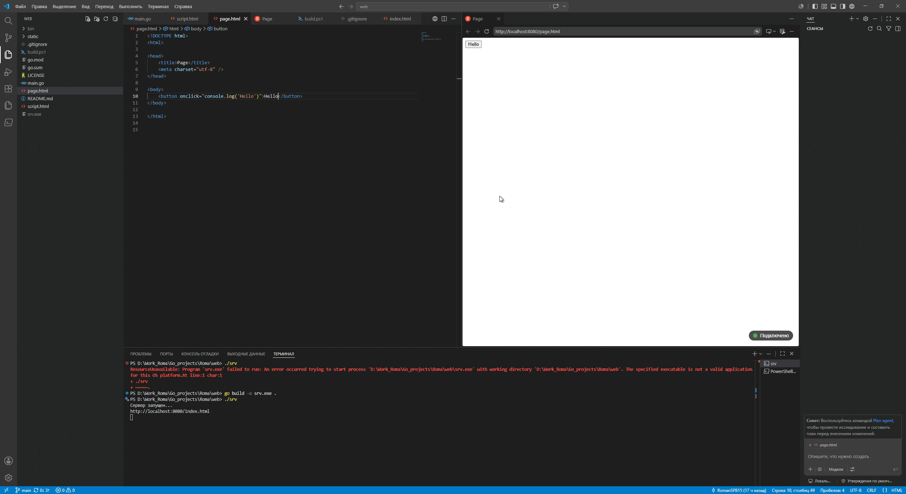

# hot-reload

**🚀 Live reload сервер для веб-разработки.**
## Запуск
Скачайте последнюю версию из Releases и запустите.

Теги запуска:
- `-dir` — директория с фронтендом.

## Использование
- Перейдите по ссылке http://localhost:8080/index.html (или другой файл .html).

При изменении файлов страница в браузере автоматически перезагружается.

## Как работает
- Сервер подписывается на изменения в файловой системы с помощью `fsnotify`. Также он добавляет jJS-скрипт, который с помощью `WebSocket` получает от сервера сигнал, что файл изменился, и перезагружает страницу.
О работе сообщает индикатор справа снизу.

## Лицензия
`MIT`
